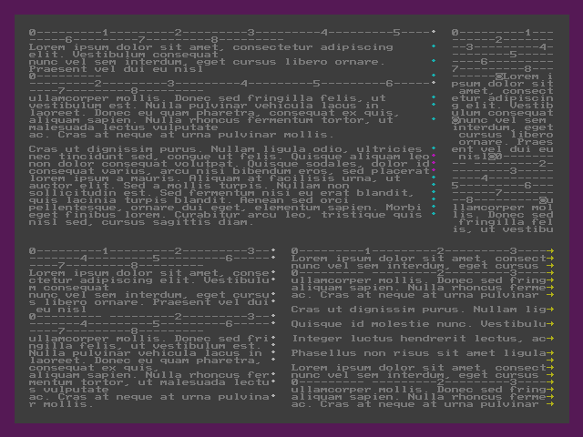
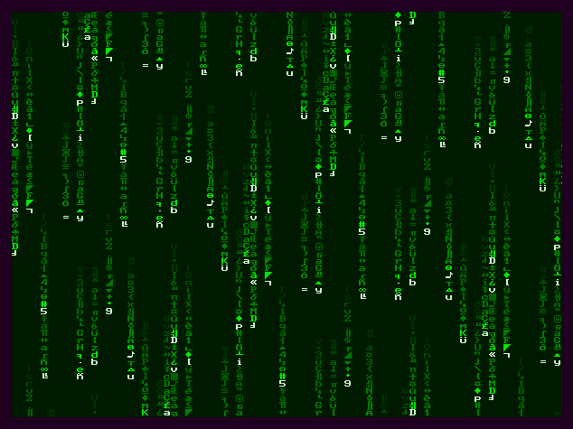

# c256
code snippets for C256 Foenix

#### compiling

```
64tass --m65816 --long-address --intel-hex -o filename.hex --list filename.lst filename.asm
```

### textbox.asm
demo of text-displaying routines. So far there is one element implemented: text box. See code for detailed description.



#### required files
required by textbox.asm, should be placed in the same directory

_moby.txt_: sample text included in _textbox.asm_ taken from Project Gutenberg

_vicky_def.asm, page_00_inc.asm, macros_inc.asm_ should be taken from https://github.com/Trinity-11/Kernel 

### matrix.asm
simple matrix-like effect. Warning - very crude delay loop, speed may vary on different platforms!



#### required files
should be placed in the same directory

_vicky_def.asm, page_00_inc.asm, macros_inc.asm_ should be taken from https://github.com/Trinity-11/Kernel 
